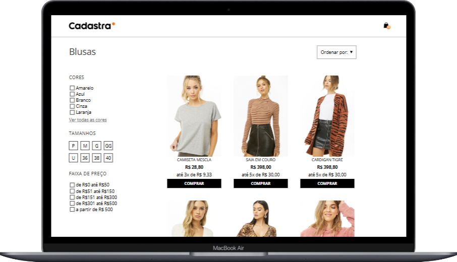

### <h1>PROJETO DE CONSTRUÇÃO DE UMA PAGINA DE CATEGORIA </h1>
Este projeto é uma aplicação web de e-commerce que permite aos usuários navegar por uma variedade de produtos, aplicar filtros, visualizar detalhes dos itens e gerenciar um carrinho de compras. O objetivo principal é proporcionar uma experiência de compra intuitiva e responsiva, com uma interface amigável e funcionalidades práticas.

### <h2> para o funcionamento do projeto será necessario: </h2>
rodar na porta 3000 -- localhost:3000
### npm start

 ### <h2> modificação do arquivo package.json </h2>
 "start": "cross-env SERVER_API=http://localhost:5000 npm-run-all --parallel dev server",

### <h1> Funcionalidades Principais </h1>
 ### Exibição de Produtos:
 Os produtos são carregados dinamicamente de uma API, permitindo que os usuários vejam informações detalhadas, como imagem, nome, preço, tamanhos e cores disponíveis.

### Filtros de Pesquisa:
Os usuários podem filtrar produtos por cor, tamanho e faixa de preço, facilitando a busca por itens específicos.

### Carrinho de Compras:
Os usuários podem adicionar produtos ao carrinho, visualizar os itens selecionados e esvaziar o carrinho quando desejarem.

#### Modal de Carrinho:
Um modal exibe os itens no carrinho, permitindo que os usuários vejam rapidamente suas seleções.

### Ordenação de Produtos:
Os produtos podem ser ordenados por preço ou data de lançamento, oferecendo flexibilidade na visualização dos produtos.

### <h1> Ferramentas Utilizadas </h1>
### HTML5: 
Estrutura básica da página, definindo a semântica e o layout do conteúdo.
### CSS3/Scss: 
Estilização da aplicação, garantindo um design responsivo e atraente.
### TypeScript: 
Linguagem de programação que adiciona tipagem estática ao JavaScript, melhorando a robustez e a manutenção do código.
### Fetch API: 
Utilizada para realizar requisições HTTP à API do servidor, permitindo o carregamento dinâmico de produtos.
### Local Storage: 
Armazenamento local para manter os dados do carrinho de compras, permitindo que os usuários mantenham seus itens mesmo após recarregar a página.
### Media Queries: 
CSS para garantir que a aplicação seja responsiva e se adapte a diferentes tamanhos de tela, proporcionando uma ótima experiência em dispositivos móveis.
 
### Email para contato: allan.aj1993@gmail.com

